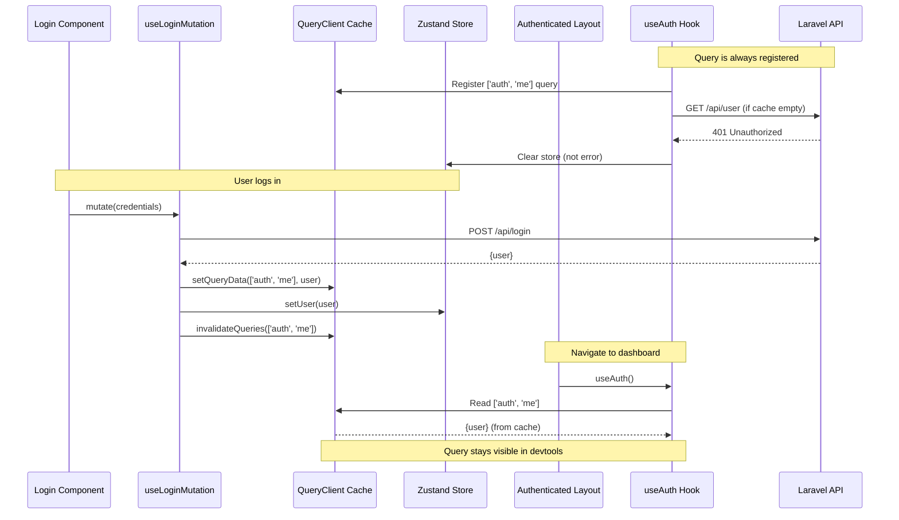

# Align TanStack Query Auth Pattern with Staff Portal

## Problem Summary

Current implementation has TanStack Query visibility issues:

1. Auth query disappears from devtools after login/navigation
2. Query is conditionally enabled (`enabled: isHydrated && storeIsAuthenticated()`), so it's not registered until conditions are met
3. Inconsistent with staff-portal's always-visible pattern
4. Missing `queryOptions` factory pattern (TanStack Query v5 best practice)

## Root Cause

The primary difference between staff-portal and current implementation:**Staff Portal:**

- Uses `queryOptions` factory with `staleTime: Infinity`
- Query is **always enabled** (no conditional enabling)
- Query key: `['auth', 'me']`
- Query registers immediately when component mounts

**Belive-FO-Client:**

- Inline query options in `useAuth`
- Query is **conditionally enabled**: `enabled: isHydrated && storeIsAuthenticated()`
- Query key: `['auth', 'user']`
- Query only registers when conditions are true

## Solution Strategy

Adopt staff-portal pattern while preserving dual auth (email + Lark OAuth) requirements:

### Trade-offs

**Option A: Full Staff-Portal Pattern (Recommended)**

- ✅ Query always visible in devtools
- ✅ Follows TanStack Query v5 best practices
- ✅ Simpler mental model
- ❌ May trigger unnecessary API calls when not authenticated
- **Mitigation:** API returns 401, query handles it gracefully, clears store

**Option B: Hybrid Pattern**

- ✅ Only queries when authenticated
- ❌ Query still disappears from devtools
- ❌ Doesn't solve visibility issue

**Recommendation:** Option A - aligns with staff-portal, industry best practice

## Implementation Plan

### 1. Create auth constants file

Create [`src/shared/lib/api-client/auth-constants.ts`](src/shared/lib/api-client/auth-constants.ts):

```typescript
export const AUTH_QUERY_KEYS = {
  ME: ['auth', 'me'] as const,
  LOGIN: ['auth', 'login'] as const,
  LARK_LOGIN: ['auth', 'lark-login'] as const,
} as const

export const AUTH_CONFIG = {
  STALE_TIME: Infinity, // Auth never goes stale
  RETRY: false, // Don't retry auth failures
} as const
```


### 2. Refactor useAuth hook

Update [`src/shared/hooks/useAuth.ts`](src/shared/hooks/useAuth.ts):**Key changes:**

- Remove conditional enabling (`enabled` option)
- Add `queryOptions` factory pattern
- Use `staleTime: Infinity`
- Change query key to `['auth', 'me']`
- Handle 401 gracefully without failing
```typescript
import { useQuery, queryOptions } from '@tanstack/react-query'
import { AUTH_QUERY_KEYS, AUTH_CONFIG } from '@/shared/lib/api-client/auth-constants'

export const authQueryOptions = queryOptions({
  queryKey: AUTH_QUERY_KEYS.ME,
  queryFn: async () => {
    const response = await getCurrentUser()
    // ... validation logic
    return validated.user
  },
  retry: AUTH_CONFIG.RETRY,
  staleTime: AUTH_CONFIG.STALE_TIME,
})

export function useAuth() {
  const { setUser, storeLogout } = useAuthStore()
  
  const query = useQuery({
    ...authQueryOptions,
    // No 'enabled' - query is always active
  })
  
  // Handle 401: clear store but don't treat as error
  useEffect(() => {
    if (query.error?.status === 401) {
      storeLogout()
    }
  }, [query.error])
  
  // ... rest of implementation
}
```


### 3. Update login mutations

Update [`src/shared/hooks/useLoginMutation.ts`](src/shared/hooks/useLoginMutation.ts) and [`src/shared/hooks/useLarkLoginMutation.ts`](src/shared/hooks/useLarkLoginMutation.ts):**Add mutation keys and cache invalidation:**

```typescript
import { AUTH_QUERY_KEYS } from '@/shared/lib/api-client/auth-constants'

export function useLoginMutation() {
  const queryClient = useQueryClient()
  
  return useMutation({
    mutationKey: AUTH_QUERY_KEYS.LOGIN,
    mutationFn: loginUser,
    onSuccess: (user) => {
      // Set query cache
      queryClient.setQueryData(AUTH_QUERY_KEYS.ME, user)
      // Store in Zustand
      setUser(user)
      // Invalidate to trigger refetch
      queryClient.invalidateQueries({ queryKey: AUTH_QUERY_KEYS.ME })
    },
  })
}
```


### 4. Simplify login components

Remove `useAuth` from login flows in:

- [`src/app/(public)/login/_components/AuthLogin.tsx`](src/app/\\\\\\\\\\\\\\\(public)/login/_components/AuthLogin.tsx)
- [`src/app/auth/callback/page.tsx`](src/app/auth/callback/page.tsx)

**Why:** Mutations handle cache updates, `useAuth` in authenticated layout will pick up the cached data automatically.

### 5. Keep useAuth in authenticated layout

[`src/app/(authenticated)/layout.tsx`](src/app/\\\\\\\\\\\\\\\(authenticated)/layout.tsx) already calls `useAuth` - keep this as-is. This ensures the query stays observed across all authenticated routes.

### 6. Remove verbose logging

Clean up [`src/components/providers/query-provider.tsx`](src/components/providers/query-provider.tsx):

- Remove periodic cache logging (line 136-149)
- Keep mutation event listeners for debugging
- Remove window debug helpers (production code shouldn't expose internals)

### 7. Runtime verification

Use Next.js MCP tools to verify:

```bash
# Check no runtime errors
nextjs_call --port 3000 --tool get_errors

# Verify query appears in cache after login
# Should see ['auth', 'me'] in TanStack Query Devtools
```


## Files to modify

1. **Create:** `src/shared/lib/api-client/auth-constants.ts` (new file)
2. **Refactor:** `src/shared/hooks/useAuth.ts` (queryOptions pattern, remove conditional enabling)
3. **Update:** `src/shared/hooks/useLoginMutation.ts` (add mutation key, invalidation)
4. **Update:** `src/shared/hooks/useLarkLoginMutation.ts` (add mutation key, invalidation)
5. **Simplify:** `src/app/(public)/login/_components/AuthLogin.tsx` (remove useAuth call)
6. **Simplify:** `src/app/auth/callback/page.tsx` (remove useAuth call)
7. **Clean:** `src/components/providers/query-provider.tsx` (remove verbose logging)

## Expected outcome

After implementation:

- ✅ Auth query `['auth', 'me']` always visible in TanStack Query Devtools
- ✅ Query persists across navigation (login → dashboard)
- ✅ Follows TanStack Query v5 best practices
- ✅ Matches staff-portal pattern
- ✅ Proper cache invalidation on login/logout
- ✅ 401 errors handled gracefully (clears store, doesn't show as error)
- ✅ No runtime errors in Next.js MCP verification

## Architecture diagram




## About event-bus.ts

**Decision:** Do NOT use event-bus for auth state synchronization.**Reasoning:**

- Event bus is for **cross-module communication** (e.g., feature A notifies feature B)
- Auth state is **shared state**, not cross-module events