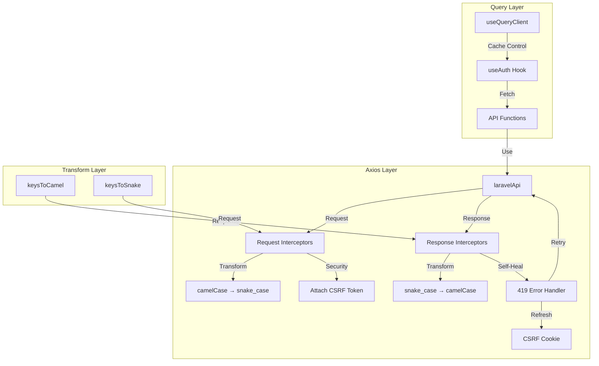

# Align TanStack Query

Auth Pattern with Axios Implementation

## Overview

This plan implements a production-ready Axios-based API client with automatic transformations, CSRF token management, self-healing session capabilities, and migrates authentication hooks to use `useQueryClient` for better cache control.

## Architecture




## Implementation Tasks

### 1. Transform Utilities (`src/shared/lib/transform.ts`)

**Current State:** Placeholder file**Implementation:**

- Implement `keysToCamel<T>(obj)` - Recursively converts snake_case keys to camelCase
- Implement `keysToSnake<T>(obj)` - Recursively converts camelCase keys to snake_case
- Handle edge cases: null, undefined, arrays, nested objects, FormData, Date objects
- Preserve non-object types (primitives, Date, FormData)

**Reference:** `RenoXpert-Client/apps/staff-portal/src/lib/transform.ts`

### 2. Axios Instance Configuration (`src/shared/lib/api-client/axios-instance.ts`)

**Current State:** Empty placeholder**Implementation:**

- Create `laravelApi` instance:
- Base URL: `${LARAVEL_API_URL}/api/v1`
- `withCredentials: true` (for session cookies)
- Default headers: `Accept: application/json`
- Create `laravelRootApi` instance:
- Base URL: `${LARAVEL_API_URL}`
- Same credentials and headers configuration
- Export both instances for use in interceptors and API functions

**Reference:** `RenoXpert-Client/apps/staff-portal/src/lib/api/axios.ts` (lines 23-100)

### 3. Request/Response Interceptors (`src/shared/lib/api-client/interceptors.ts`)

**Current State:** Empty placeholder**Implementation:**

#### Request Interceptors:

1. **Transform Request Data:**

- Convert request body from camelCase to snake_case
- Skip transformation for FormData instances
- Apply recursively to nested objects

2. **CSRF Token Automation:**

- Extract CSRF token from `XSRF-TOKEN` cookie (client-side only)
- Automatically attach as `X-XSRF-TOKEN` header to every request
- Handle SSR gracefully (no-op when `document` is undefined)

#### Response Interceptors:

1. **Transform Response Data:**

- Convert response data from snake_case to camelCase
- Apply recursively to nested objects and arrays

2. **Self-Healing Session (419 Error Handler):**

- Intercept 419 (CSRF token mismatch) errors
- Automatically fetch new CSRF cookie from `/sanctum/csrf-cookie`
- Extract new CSRF token from cookie
- Retry the original failed request with new token
- Reject with original error if refresh fails
- Prevent infinite retry loops (only retry once per request)

**Reference:** `RenoXpert-Client/apps/staff-portal/src/lib/api/axios.ts` (lines 7-84)

### 4. Update Laravel Client (`src/shared/lib/api-client/laravel-client.ts`)

**Current State:** Uses native `fetch` API**Migration:**

- Replace `apiFetch` function with Axios calls using `laravelApi` and `laravelRootApi`
- Update `getCsrfCookie()` to use `laravelRootApi.get('/sanctum/csrf-cookie')`
- Update `loginWithEmail()` to use `laravelApi.post('/login', body)`
- Update `getCurrentUser()` to use `laravelApi.get('/user')`
- Update `logoutUser()` to use `laravelApi.post('/auth/logout')`
- Update `loginWithLark()` to use `laravelApi.post('/auth/lark/callback', { code })`
- Maintain existing function signatures for backward compatibility
- Remove manual CSRF token handling (now automated via interceptors)
- Remove manual snake_case conversion (now automated via interceptors)
- Update error handling to work with Axios error structure

**Key Changes:**

- Transformations are now automatic (no manual `keysToSnake` calls)
- CSRF token attachment is automatic (no manual header setting)
- 419 errors are automatically retried (no manual retry logic needed)

### 5. Migrate useAuth to useQueryClient Pattern (`src/shared/hooks/useAuth.ts`)

**Current State:** Uses `useQuery` directly**Migration:**

- Import `useQueryClient` from `@tanstack/react-query`
- Create `authQueryOptions` using `queryOptions` factory pattern
- Use `useQueryClient().fetchQuery()` or `useQueryClient().getQueryData()` for cache access
- Replace direct `useQuery` call with `useQuery(authQueryOptions)`
- Use `queryClient.setQueryData()` for optimistic updates
- Use `queryClient.invalidateQueries()` for cache invalidation
- Use `queryClient.remove()` in logout function
- Maintain backward compatibility with existing hook API

**Benefits:**

- Better cache control and programmatic access
- Consistent with TanStack Query best practices
- Enables cache manipulation from mutations
- Supports prefetching and background updates

**Reference:** `RenoXpert-Client/apps/staff-portal/src/lib/api/auth/auth.hooks.ts` (lines 21-30, 32-48)

### 6. Export Axios Instances (`src/shared/lib/api-client/index.ts`)

**Current State:** Only exports Laravel client functions**Updates:**

- Export `laravelApi` and `laravelRootApi` for direct use in feature modules
- Export transform utilities (`keysToCamel`, `keysToSnake`) if needed elsewhere
- Maintain existing exports for backward compatibility

### 7. Standardization

**API Client Standardization:**

- All API calls must use Axios instances (no direct fetch calls)
- All requests automatically transformed (camelCase → snake_case)
- All responses automatically transformed (snake_case → camelCase)
- CSRF tokens automatically attached to all requests
- 419 errors automatically handled with retry logic

**Query Pattern Standardization:**

- Use `queryOptions` factory for reusable query configurations
- Use `useQueryClient()` for cache manipulation
- Use `useQuery(queryOptions)` for data fetching hooks
- Use `useMutation` with `onSuccess` callbacks for cache updates

**File Structure:**

```javascript
src/shared/lib/
  ├── transform.ts              # Transform utilities (keysToCamel, keysToSnake)
  └── api-client/
      ├── axios-instance.ts     # Axios instances (laravelApi, laravelRootApi)
      ├── interceptors.ts       # Request/response interceptors
      ├── laravel-client.ts    # API functions (uses Axios)
      └── index.ts             # Exports
```


## Security Features

1. **CSRF Token Automation:**

- Automatically extracts token from cookie
- Attaches to every request header
- No manual token management required

2. **Self-Healing Session:**

- Detects expired CSRF tokens (419 errors)
- Silently refreshes CSRF cookie
- Automatically retries failed request
- Transparent to calling code

3. **Session Cookie Management:**

- `withCredentials: true` ensures cookies are sent
- Automatic cookie handling via browser
- No manual cookie manipulation needed

## Error Handling

- **419 Errors:** Automatically handled with retry logic
- **401 Errors:** Pass through to calling code (handled by useAuth)
- **Network Errors:** Pass through with proper error structure
- **Validation Errors:** Maintained via Zod schemas in `safeFetch`

## Testing Considerations

- Verify CSRF token is attached to all requests
- Verify 419 errors trigger automatic retry
- Verify transformations work for nested objects
- Verify FormData is not transformed
- Verify useQueryClient cache operations work correctly
- Verify backward compatibility of API functions

## Migration Notes

- Existing code using `laravel-client.ts` functions will continue to work
- Transformations are now automatic (no breaking changes)
- CSRF handling is now automatic (no breaking changes)
- `useAuth` hook API remains the same (backward compatible)
- Direct fetch calls should be migrated to use Axios instances

## Dependencies

- `axios` package (already in project or needs installation)
- `@tanstack/react-query` (already installed)
- Transform utilities (to be implemented)

## Files to Modify

1. `src/shared/lib/transform.ts` - Implement transform utilities
2. `src/shared/lib/api-client/axios-instance.ts` - Create Axios instances
3. `src/shared/lib/api-client/interceptors.ts` - Implement interceptors