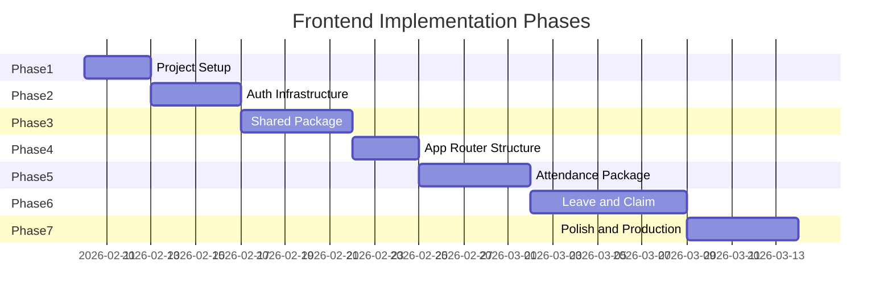

# Frontend Implementation Plan

This plan outlines the phased implementation of the BeLive FlowOffice frontend, a Next.js monorepo integrating with Lark, Laravel, and Supabase. The monorepo structure enables independent feature development through separate packages while maintaining a single Next.js application following Next.js best practices.

---

## Phase 1: Project Setup and Foundation

**Goal:** Establish a properly configured monorepo with Next.js 14+ application, pnpm workspaces, Turborepo, and essential tooling.

### 1.1 Initialize Monorepo Structure

- Create root directory and initialize pnpm workspace
- Create `pnpm-workspace.yaml` with workspace configuration:
  ```yaml
  packages:
    - "apps/*"
    - "packages/*"
  ```
- Install Turborepo as dev dependency at root: `pnpm add -D -w turbo`
- Create root `package.json` with workspace scripts
- Create `turbo.json` for build pipeline configuration

### 1.2 Initialize Next.js Application

- Create Next.js app in `apps/belive-fo/` using `create-next-app` with TypeScript, Tailwind CSS, ESLint, and the App Router enabled
- Select `src/` directory option for cleaner separation
- Configure `turbopack` for faster development builds (use `--turbo` flag)
- Set unique port in `package.json` dev script (e.g., `"dev": "next dev --turbo -p 3000"`)

### 1.3 Configure TypeScript Strictly

- Enable strict mode in `apps/belive-fo/tsconfig.json`
- Configure path aliases for clean imports (standard Next.js pattern):
  - `@/*` pointing to `./src/*`
- Create base `tsconfig.json` at root for shared TypeScript configuration
- Extend base config in app and package TypeScript configs

### 1.4 Set Up Package Structure

- Create `packages/shared/` directory for shared infrastructure
- Create `packages/shared/package.json` with name `@belive/shared` and `"private": true`
- Create `packages/shared/tsconfig.json` extending root config
- Create `packages/shared/src/index.ts` for public API exports
- Repeat for feature packages: `packages/attendance/`, `packages/leave/`, `packages/claims/`, `packages/lark-sdk/`

### 1.5 Configure ESLint

- Set up ESLint configuration in `apps/belive-fo/` following Next.js recommendations
- Configure import sorting rules for consistency
- Packages enforce boundaries naturally through package.json dependencies (no need for module boundary rules)

### 1.6 Install Core Dependencies

**In `apps/belive-fo/`:**
- **State Management:** TanStack Query, Zustand
- **Forms:** react-hook-form, @hookform/resolvers, Zod
- **UI:** shadcn/ui (initialize with default config), Iconify-icons, lucide-react
- **Supabase:** @supabase/supabase-js
- **Template:** Integrate Modernize Template base styles and layout components
- **Workspace Packages:** `@belive/shared`, `@belive/attendance`, `@belive/leave`, `@belive/claims`, `@belive/lark-sdk` (using `workspace:*` protocol)

**In `packages/shared/`:**
- **State Management:** Zustand (for stores)
- **Supabase:** @supabase/supabase-js
- **TanStack Query:** @tanstack/react-query (for query client setup)

### 1.7 Set Up Environment Variables

- Create `apps/belive-fo/.env.local` with placeholders for:
  - `NEXT_PUBLIC_SUPABASE_URL`
  - `NEXT_PUBLIC_SUPABASE_ANON_KEY`
  - `NEXT_PUBLIC_LARAVEL_API_URL`
  - `BFF_INTERNAL_SECRET`
  - `NEXT_PUBLIC_LARK_APP_ID`
- Create `apps/belive-fo/.env.example` for team reference

### 1.8 Establish Directory Structure

Create the monorepo folder structure:

```
Belive-FO-Client/
├── apps/
│   └── belive-fo/              # Next.js application
│       ├── src/
│       │   ├── app/           # App Router
│       │   │   ├── api/       # Next.js API routes (middleware/proxy layer)
│       │   │   │   ├── attendance/
│       │   │   │   │   └── route.ts
│       │   │   │   ├── leave/
│       │   │   │   │   └── route.ts
│       │   │   │   ├── claims/
│       │   │   │   │   └── route.ts
│       │   │   │   └── auth/
│       │   │   │       └── route.ts
│       │   │   ├── (authenticated)/  # Protected dashboard routes
│       │   │   │   ├── layout.tsx
│       │   │   │   ├── attendance/
│       │   │   │   │   └── page.tsx
│       │   │   │   ├── leave/
│       │   │   │   │   └── page.tsx
│       │   │   │   └── claims/
│       │   │   │       └── page.tsx
│       │   │   ├── (public)/  # Public routes (login, etc.)
│       │   │   │   └── layout.tsx
│       │   │   ├── layout.tsx
│       │   │   ├── page.tsx
│       │   │   └── globals.css
│       │   ├── components/
│       │   │   └── ui/        # shadcn/ui components
│       │   │       ├── button.tsx
│       │   │       ├── form.tsx
│       │   │       ├── input.tsx
│       │   │       ├── dialog.tsx
│       │   │       ├── label.tsx
│       │   │       └── sonner.tsx
│       │   ├── lib/
│       │   │   ├── auth.ts
│       │   │   ├── proxy.ts
│       │   │   ├── transform.ts  # snake_case -> camelCase
│       │   │   ├── utils.ts       # shadcn/ui utilities (cn helper)
│       │   │   └── api/           # API client modules
│       │   │       ├── attendance/
│       │   │       │   └── index.ts
│       │   │       ├── leave/
│       │   │       │   └── index.ts
│       │   │       └── claim/
│       │   │           └── index.ts
│       │   └── hooks/
│       ├── public/
│       ├── package.json       
│       ├── next.config.mjs
│       ├── tsconfig.json
│       └── .env.local
├── packages/
│   ├── shared/
│   │   ├── src/
│   │   │   ├── components/
│   │   │   ├── hooks/
│   │   │   │   ├── usePermissions.ts
│   │   │   │   ├── useAuth.ts
│   │   │   │   ├── useHydration.ts
│   │   │   │   └── index.ts
│   │   │   ├── lib/
│   │   │   │   ├── api-client/        # Enhanced with Axios
│   │   │   │   │   ├── axios-instance.ts
│   │   │   │   │   ├── laravel-client.ts
│   │   │   │   │   ├── supabase-client.ts
│   │   │   │   │   ├── interceptors.ts
│   │   │   │   │   └── index.ts
│   │   │   │   ├── validation/        # Zod schemas
│   │   │   │   │   ├── common.schemas.ts
│   │   │   │   │   ├── validators.ts
│   │   │   │   │   └── index.ts
│   │   │   │   ├── supabase/          # Supabase utilities
│   │   │   │   │   └── client.ts
│   │   │   │   ├── event-bus.ts
│   │   │   │   ├── permissions.ts
│   │   │   │   ├── rbac.ts
│   │   │   │   └── transform.ts       # snake_case -> camelCase
│   │   │   ├── stores/
│   │   │   │   ├── auth-store.ts
│   │   │   │   └── ui-store.ts
│   │   │   └── types/
│   │   │       ├── roles.ts
│   │   │       ├── permissions.ts
│   │   │       ├── api.types.ts       # API response types
│   │   │       └── index.ts
│   │   ├── package.json               # Add: zod, axios, @supabase/supabase-js
│   │   └── tsconfig.json
│   ├── attendance/
│   │   ├── src/
│   │   │   ├── features/                      # sub-modules (example)
│   │   │   │   ├── attendance-records/
│   │   │   │   │   ├── api/
│   │   │   │   │   │   ├── client.ts          # Axios API calls
│   │   │   │   │   │   ├── endpoints.ts       # API endpoint definitions
│   │   │   │   │   │   └── index.ts
│   │   │   │   │   ├── components/
│   │   │   │   │   ├── hooks/
│   │   │   │   │   ├── schemas/               # Zod validation schemas
│   │   │   │   │   │   ├── attendance.schema.ts
│   │   │   │   │   │   └── index.ts
│   │   │   │   │   ├── types/
│   │   │   │   │   │   ├── attendance.types.ts
│   │   │   │   │   │   └── index.ts
│   │   │   │   │   └── index.ts
│   │   │   │   ├── schedules/
│   │   │   │   │   ├── api/
│   │   │   │   │   │   ├── client.ts
│   │   │   │   │   │   ├── endpoints.ts
│   │   │   │   │   │   └── index.ts
│   │   │   │   │   ├── components/
│   │   │   │   │   ├── hooks/
│   │   │   │   │   ├── schemas/
│   │   │   │   │   │   ├── schedule.schema.ts
│   │   │   │   │   │   └── index.ts
│   │   │   │   │   ├── types/
│   │   │   │   │   └── index.ts
│   │   │   │   ├── overtime/
│   │   │   │   │   ├── api/
│   │   │   │   │   ├── components/
│   │   │   │   │   ├── hooks/
│   │   │   │   │   ├── schemas/
│   │   │   │   │   ├── types/
│   │   │   │   │   └── index.ts
│   │   │   │   └── reports/
│   │   │   │       ├── api/
│   │   │   │       ├── components/
│   │   │   │       ├── hooks/
│   │   │   │       ├── schemas/
│   │   │   │       ├── types/
│   │   │   │       └── index.ts
│   │   │   ├── views/
│   │   │   │   ├── SuperAdminView/
│   │   │   │   ├── AdminView/
│   │   │   │   ├── StaffView/
│   │   │   │   └── index.ts
│   │   │   ├── shared/
│   │   │   │   ├── components/
│   │   │   │   ├── schemas/           # Shared Zod schemas
│   │   │   │   │   └── common.schema.ts
│   │   │   │   └── utils/
│   │   │   └── index.ts
│   │   ├── package.json
│   │   └── tsconfig.json
│   ├── leave/
│   │   ├── src/
│   │   │   ├── features/                      # sub-modules (example)
│   │   │   │   ├── leave-requests/
│   │   │   │   │   ├── api/
│   │   │   │   │   │   ├── client.ts
│   │   │   │   │   │   ├── endpoints.ts
│   │   │   │   │   │   └── index.ts
│   │   │   │   │   ├── components/
│   │   │   │   │   ├── hooks/
│   │   │   │   │   ├── schemas/
│   │   │   │   │   │   ├── leave-request.schema.ts
│   │   │   │   │   │   └── index.ts
│   │   │   │   │   ├── types/
│   │   │   │   │   └── index.ts
│   │   │   │   ├── leave-balance/
│   │   │   │   │   ├── api/
│   │   │   │   │   ├── components/
│   │   │   │   │   ├── hooks/
│   │   │   │   │   ├── schemas/
│   │   │   │   │   ├── types/
│   │   │   │   │   └── index.ts
│   │   │   │   ├── approvals/
│   │   │   │   │   ├── api/
│   │   │   │   │   ├── components/
│   │   │   │   │   ├── hooks/
│   │   │   │   │   ├── schemas/
│   │   │   │   │   ├── types/
│   │   │   │   │   └── index.ts
│   │   │   │   └── calendar/
│   │   │   │       ├── api/
│   │   │   │       ├── components/
│   │   │   │       ├── hooks/
│   │   │   │       ├── schemas/
│   │   │   │       ├── types/
│   │   │   │       └── index.ts
│   │   │   ├── views/
│   │   │   │   ├── SuperAdminView/
│   │   │   │   ├── AdminView/
│   │   │   │   ├── StaffView/
│   │   │   │   └── index.ts
│   │   │   ├── shared/
│   │   │   │   ├── components/
│   │   │   │   ├── schemas/
│   │   │   │   └── utils/
│   │   │   └── index.ts
│   │   ├── package.json
│   │   └── tsconfig.json
│   ├── claims/
│   │   ├── src/
│   │   │   ├── features/                      #sub-modules (example)
│   │   │   │   ├── claim-submission/
│   │   │   │   │   ├── api/
│   │   │   │   │   │   ├── client.ts
│   │   │   │   │   │   ├── endpoints.ts
│   │   │   │   │   │   └── index.ts
│   │   │   │   │   ├── components/
│   │   │   │   │   ├── hooks/
│   │   │   │   │   ├── schemas/
│   │   │   │   │   │   ├── claim.schema.ts
│   │   │   │   │   │   └── index.ts
│   │   │   │   │   ├── types/
│   │   │   │   │   └── index.ts
│   │   │   │   ├── claim-approval/
│   │   │   │   │   ├── api/
│   │   │   │   │   ├── components/
│   │   │   │   │   ├── hooks/
│   │   │   │   │   ├── schemas/
│   │   │   │   │   ├── types/
│   │   │   │   │   └── index.ts
│   │   │   │   ├── claim-history/
│   │   │   │   │   ├── api/
│   │   │   │   │   ├── components/
│   │   │   │   │   ├── hooks/
│   │   │   │   │   ├── schemas/
│   │   │   │   │   ├── types/
│   │   │   │   │   └── index.ts
│   │   │   │   └── reimbursement/
│   │   │   │       ├── api/
│   │   │   │       ├── components/
│   │   │   │       ├── hooks/
│   │   │   │       ├── schemas/
│   │   │   │       ├── types/
│   │   │   │       └── index.ts
│   │   │   ├── views/
│   │   │   │   ├── SuperAdminView/
│   │   │   │   ├── AdminView/
│   │   │   │   ├── StaffView/
│   │   │   │   └── index.ts
│   │   │   ├── shared/
│   │   │   │   ├── components/
│   │   │   │   ├── schemas/
│   │   │   │   └── utils/
│   │   │   └── index.ts
│   │   ├── package.json
│   │   └── tsconfig.json
│   └── lark-sdk/
│       ├── src/
│       │   ├── api/
│       │   │   ├── client.ts
│       │   │   └── endpoints.ts
│       │   ├── schemas/               # Zod schemas for Lark API
│       │   │   └── lark.schema.ts
│       │   ├── types/
│       │   └── index.ts
│       ├── package.json
│       └── tsconfig.json
├── pnpm-workspace.yaml
├── turbo.json
└── package.json
```

### 1.9 Configure Turborepo

- Create `turbo.json` with task definitions:
  ```json
  {
    "tasks": {
      "build": {
        "dependsOn": ["^build"],
        "outputs": [".next/**", "dist/**"]
      },
      "dev": {
        "cache": false,
        "persistent": true
      },
      "lint": {
        "dependsOn": []
      }
    }
  }
  ```
- Configure app build to depend on package builds: `"dependsOn": ["^build"]`

### 1.10 Package Development Workflow

- **Creating a new package:** Create directory in `packages/`, add `package.json` with `@belive/*` naming, set up TypeScript config
- **Adding package dependencies:** Use `pnpm add @belive/shared --filter @belive/attendance` (workspace protocol)
- **Running commands:** From root use `pnpm --filter @belive/attendance dev` or `pnpm --filter frontend dev`
- **Feature branch strategy:** Each package can be developed in separate branches, merged independently

**Success Criteria:**

- Monorepo runs with `pnpm dev` without errors
- TypeScript compiles with no errors in strict mode across all packages
- Path aliases work correctly in Next.js app
- Package imports using workspace protocol work correctly
- Turborepo caching works for faster builds
- shadcn/ui components render properly

---

## Phase 2: Authentication Infrastructure

**Goal:** Implement Lark OAuth flow and token management following Next.js patterns.

### 2.1 Create Lark SDK TypeScript Declarations

- Create `packages/lark-sdk/src/index.ts` with TypeScript interfaces for `window.tt` global object
- Include types for `getLocation`, `chooseImage`, `getWifiStatus`
- Create a wrapper module with availability checks
- Export from `packages/lark-sdk/src/index.ts` for use in other packages

### 2.2 Implement Auth Store (Zustand)

- Create `packages/shared/src/stores/auth-store.ts`
- Store `apiToken`, `supabaseToken`, and `user` object
- Use `persist` middleware with `partialize` to only persist tokens
- Implement `setTokens`, `logout`, and `isAuthenticated` methods
- Export from `packages/shared/src/index.ts` for use in app and other packages

### 2.3 Build Lark OAuth Flow

- Create `apps/belive-fo/src/lib/auth/lark-auth.ts` with `loginWithLark(code)` function
- Exchange Lark authorization code with Laravel backend
- Parse response containing both `api_token` and `supabase_token`
- Use auth store from `@belive/shared` to store tokens

### 2.4 Create Auth Callback Page

- Implement `apps/belive-fo/src/app/auth/callback/page.tsx` as a Client Component
- Extract `code` from URL search params
- Call `loginWithLark`, store tokens using auth store from `@belive/shared`, and redirect to dashboard

### 2.5 Implement Next.js Middleware for Route Protection

- Create `apps/belive-fo/middleware.ts` at app root   // Next.js middleware
- Check for auth token in cookies/localStorage
- Redirect unauthenticated users to `/login`
- Configure matcher to exclude public routes (`/login`, `/auth/*`, `/_next/*`)

### 2.6 Handle Hydration Safety for Auth State

- Create `useHydration` hook in `packages/shared/src/hooks/useHydration.ts`
- Export from `packages/shared/src/index.ts`
- Wrap auth-dependent components with hydration guards
- Use skeleton loaders during hydration to prevent mismatches

**Success Criteria:**

- Lark OAuth redirect works correctly
- Tokens are stored and persisted across page refreshes
- Protected routes redirect to login when unauthenticated
- No hydration mismatch errors in console

---

## Phase 3: Shared Package and Infrastructure

**Goal:** Build the shared infrastructure package that all feature packages depend on.

### 3.1 Set Up Shared Package

- Ensure `packages/shared/package.json` is configured with name `@belive/shared`
- Set up TypeScript configuration extending root config
- Create `packages/shared/src/index.ts` to export public API
- Add dependencies: Zustand, @supabase/supabase-js, @tanstack/react-query

### 3.2 Create Event Bus for Package Communication

- Implement `packages/shared/src/lib/event-bus.ts`
- Support typed event subscriptions with `on(event, callback)`
- Support event emission with `emit(event, payload)`
- Return unsubscribe functions for cleanup
- Export from `packages/shared/src/index.ts`

### 3.3 Build Laravel API Client

- Create `packages/shared/src/lib/api-client.ts` as a class-based client
- Implement `get`, `post`, `put`, `delete` methods
- Automatically attach `Authorization` header from auth store
- Handle common error responses (401, 403, 500)
- Export from `packages/shared/src/index.ts`

### 3.4 Configure TanStack Query

- Create `packages/shared/src/lib/query-client.ts` with sensible defaults
- Set `staleTime` for caching strategy
- Configure global error handler for 401 redirects
- Export query client factory function
- Use in `apps/belive-fo/src/app/layout.tsx` to wrap app with `QueryClientProvider`

### 3.5 Create Supabase Client Factory

- Implement `packages/shared/src/lib/supabase/client.ts` with `getSupabaseClient()` function
- Initialize client with Supabase JWT from auth store
- Set `persistSession: false` (Laravel manages auth)
- Reset client when user logs out (subscribe to auth store changes)
- Export from `packages/shared/src/index.ts`

### 3.6 Build Realtime Subscription Hook

- Create `packages/shared/src/hooks/useSupabaseRealtime.ts`
- Accept table, event type, optional filter, and callback
- Handle channel subscription and cleanup in useEffect
- Integrate with TanStack Query for cache updates
- Export from `packages/shared/src/index.ts`

### 3.7 Create Supabase Storage Helpers

- Implement `packages/shared/src/lib/supabase/storage.ts` with upload/download/delete functions
- Support signed URL generation for secure access
- Handle error cases gracefully
- Export from `packages/shared/src/index.ts`

### 3.8 Set Up UI Store for Global Preferences

- Create `packages/shared/src/stores/ui-store.ts`
- Manage sidebar state, theme, and language
- Use `persist` middleware with hydration guards
- Export from `packages/shared/src/index.ts`

### 3.9 Build Shared UI Components

- Add essential shadcn/ui components to `apps/belive-fo/src/components/ui/` (Button, Form, Input, Dialog, Label, Sonner)
- Create app shell layout components (AppShell, Navigation, Sidebar) in `packages/shared/src/components/layout/`
- Implement ErrorBoundary component for graceful error handling
- Export layout components from `packages/shared/src/index.ts`

**Success Criteria:**

- Event bus correctly publishes and subscribes to events
- API client successfully calls Laravel endpoints
- TanStack Query caches and refetches data correctly
- Supabase Realtime subscriptions receive updates
- UI store persists preferences without hydration errors

---

## Phase 4: App Router Structure and Layouts

**Goal:** Set up the Next.js App Router with proper layouts following best practices.

### 4.1 Create Root Layout

- Implement `apps/belive-fo/src/app/layout.tsx` with HTML structure
- Include Lark JS SDK script in head
- Wrap children with `QueryClientProvider` from `@belive/shared`
- Set up font loading with `next/font`
- Configure metadata for SEO

### 4.2 Create Route Groups

- Set up `(public)` route group in `apps/belive-fo/src/app/(public)/` for login and public pages
- Set up `(authenticated)` route group in `apps/belive-fo/src/app/(authenticated)/` for protected pages
- Each group gets its own layout for different UI shells

### 4.3 Implement Authenticated Layout

- Create `apps/belive-fo/src/app/(authenticated)/layout.tsx`
- Import and use AppShell, Navigation, and Sidebar components from `@belive/shared`
- Initialize global Supabase Realtime listeners here
- Handle auth checking and redirects using auth store from `@belive/shared`

### 4.4 Create Loading and Error States

- Add `loading.tsx` files for route-level loading UI in `apps/belive-fo/src/app/`
- Add `error.tsx` files for route-level error boundaries
- Create `not-found.tsx` for 404 handling
- Use React Suspense boundaries where appropriate

### 4.5 Configure Server Components vs Client Components

- Default to Server Components for pages
- Mark interactive components with `'use client'` directive
- Import package components (from `@belive/*` packages) as needed
- Identify data fetching patterns (server vs client)
- Plan component composition to minimize client bundle

**Success Criteria:**

- Route groups correctly apply different layouts
- Loading states appear during navigation
- Error boundaries catch and display errors gracefully
- Server and Client Components work together without issues

---

## Phase 5: Attendance Package (First Feature Package)

**Goal:** Build the first complete feature package as a vertical slice.

### 5.1 Create Package Structure

- Create `packages/attendance/` directory
- Create `packages/attendance/package.json` with name `@belive/attendance` and `"private": true`
- Add dependency on `@belive/shared` using workspace protocol: `"@belive/shared": "workspace:*"`
- Add dependency on `@belive/lark-sdk` for GPS functionality
- Set up TypeScript configuration extending root config

Create `packages/attendance/src/` with:

- `api/` - Package API layer (attendance-api.ts)
- `components/` - Package UI components
- `hooks/` - Business logic hooks
- `types/` - TypeScript definitions
- `events/` - Event definitions for package communication
- `index.ts` - Public API exports

### 5.2 Define Package Types

- Create attendance types in `packages/attendance/src/types/index.ts` (Attendance, ClockInData, AttendanceStats)
- Define event payload types (AttendanceClockedInPayload)
- Export only public types from `packages/attendance/src/index.ts`

### 5.3 Implement Package API Layer

- Create `packages/attendance/src/api/attendance-api.ts` with `attendanceApi` object
- Methods: `clockIn`, `clockOut`, `getList`, `getStats`
- Use Laravel API client from `@belive/shared`
- Export from `packages/attendance/src/index.ts`

### 5.4 Build TanStack Query Hooks

- Create `packages/attendance/src/hooks/useAttendanceList.ts` - Fetch attendance records
- Create `packages/attendance/src/hooks/useClockIn.ts` - Mutation for clocking in (integrates Lark SDK for GPS)
- Create `packages/attendance/src/hooks/useClockOut.ts` - Mutation for clocking out
- Implement optimistic updates for better UX
- Export all hooks from `packages/attendance/src/index.ts`

### 5.5 Create Realtime Subscription Hook

- Create `packages/attendance/src/hooks/useAttendanceRealtime.ts`
- Subscribe to attendance table changes using `useSupabaseRealtime` from `@belive/shared`
- Filter by current user ID
- Update TanStack Query cache on INSERT/UPDATE events
- Export from `packages/attendance/src/index.ts`

### 5.6 Build Package Components

- Create `packages/attendance/src/components/ClockInButton.tsx` - Handles clock-in flow with GPS
- Create `packages/attendance/src/components/AttendanceList.tsx` - Displays attendance records
- Create `packages/attendance/src/components/AttendanceCard.tsx` - Individual record display (private, not exported)
- Keep internal components private, export only public ones from `packages/attendance/src/index.ts`

### 5.7 Create Attendance Page

- Create `apps/belive-fo/src/app/(authenticated)/attendance/page.tsx` - Main attendance page
- Import components and hooks from `@belive/attendance` package
- Compose components from package's public API
- Keep page thin (routing and composition only)

### 5.8 Wire Up Event Publishing

- Publish `CLOCKED_IN` event on successful clock-in using event bus from `@belive/shared`
- Publish `CLOCKED_OUT` event on successful clock-out
- Allow other packages to react to attendance changes via event bus

**Success Criteria:**

- Clock-in with GPS works when running in Lark
- Realtime updates appear without page refresh
- Attendance list displays correctly
- Events are published and can be subscribed to

---

## Phase 6: Leave and Claim Packages

**Goal:** Build remaining feature packages following the same pattern.

### 6.1 Leave Package Structure

- Create `packages/leave/` directory
- Create `packages/leave/package.json` with name `@belive/leave` and `"private": true`
- Add dependencies: `@belive/shared` (workspace protocol)
- Set up TypeScript configuration

Create `packages/leave/src/` following same structure:

- Types: Leave, LeaveRequest, LeaveBalance in `packages/leave/src/types/`
- API: submitLeave, getLeaveList, getLeaveBalance in `packages/leave/src/api/`
- Hooks: useSubmitLeave, useLeaveList, useLeaveBalance, useLeaveRealtime in `packages/leave/src/hooks/`
- Components: LeaveRequestForm, LeaveList, LeaveBalanceWidget in `packages/leave/src/components/`
- Export all public APIs from `packages/leave/src/index.ts`
- Listeners: Subscribe to attendance events for eligibility updates using event bus from `@belive/shared`

### 6.2 Claim Package Structure

- Create `packages/claims/` directory
- Create `packages/claims/package.json` with name `@belive/claims` and `"private": true`
- Add dependencies: `@belive/shared`, `@belive/lark-sdk` (workspace protocol)
- Set up TypeScript configuration

Create `packages/claims/src/` following same structure:

- Types: Claim, ClaimReceipt in `packages/claims/src/types/`
- API: submitClaim, getClaimsList, uploadReceipt in `packages/claims/src/api/`
- Hooks: useSubmitClaim, useClaimsList, useUploadReceipt in `packages/claims/src/hooks/`
- Components: ClaimForm, ClaimsList, ReceiptUploader in `packages/claims/src/components/`
- Export all public APIs from `packages/claims/src/index.ts`
- Integrate Lark SDK from `@belive/lark-sdk` for camera capture
- Use Supabase Storage helpers from `@belive/shared` for receipt uploads

### 6.3 Cross-Package Communication

- Leave package listens to attendance `CLOCKED_IN` events via event bus from `@belive/shared`
- Refresh leave eligibility when user clocks in
- Use event bus for communication, not direct package imports
- Packages remain independent and can be developed in separate branches

### 6.4 Create Package Pages

- Create `apps/belive-fo/src/app/(authenticated)/leave/page.tsx`
- Create `apps/belive-fo/src/app/(authenticated)/claims/page.tsx`
- Import components and hooks from `@belive/leave` and `@belive/claims` packages
- Keep pages thin, compose from package public APIs

**Success Criteria:**

- Each package is self-contained and independently testable
- Cross-package communication works via event bus
- No direct imports between package internals (packages communicate via public APIs)
- All pages render correctly

---

## Phase 7: Polish and Production Readiness

**Goal:** Prepare the application for production deployment.

### 7.1 Error Handling and Edge Cases

- Implement proper error boundaries at package level
- Handle Lark SDK unavailability (desktop browser fallback) in `@belive/lark-sdk` package
- Handle offline scenarios gracefully
- Add retry logic for failed API calls in `@belive/shared` API client

### 7.2 Performance Optimization

- Implement code splitting per package using dynamic imports: `dynamic(() => import('@belive/attendance'))`
- Optimize images with `next/image`
- Configure caching headers for static assets in Next.js config
- Analyze bundle size and reduce where possible
- Leverage Turborepo caching for faster builds

### 7.3 Accessibility Audit

- Ensure all interactive elements are keyboard accessible
- Verify color contrast ratios
- Add proper ARIA labels where needed
- Test with screen readers

### 7.4 Testing Setup

- Configure Jest and React Testing Library at root level
- Write unit tests for critical hooks in each package
- Write integration tests for package flows
- Test package boundaries through package.json dependencies (no need for ESLint boundary enforcement)

### 7.5 Production Configuration

- Configure environment variables for production in `apps/belive-fo/.env.production`
- Set up proper CSP headers in Next.js config
- Configure CORS handling for API calls
- Set up monitoring and error tracking (optional: Sentry)
- Configure Turborepo for production builds

### 7.6 Documentation

- Document package public APIs in each package's README
- Create developer setup guide for monorepo
- Document environment variable requirements
- Document package development workflow and feature branch strategy
- Add inline comments for complex logic

**Success Criteria:**

- Application runs without console errors
- Lighthouse score above 90 for Performance
- All critical paths have test coverage
- Documentation is complete and accurate

---

## Implementation Timeline



---

## Key Next.js Best Practices Applied

1. **App Router First** - Using the modern App Router with Server Components by default
2. **Thin Pages** - Pages are composition layers, logic lives in packages
3. **Server Components by Default** - Only marking interactive parts as Client Components
4. **Proper Loading/Error States** - Using file-based loading.tsx and error.tsx
5. **Middleware for Auth** - Centralized route protection at the edge
6. **Environment Variables** - Proper separation of public vs server-only variables
7. **TypeScript Strict Mode** - Catching errors at compile time
8. **Path Aliases** - Clean imports using standard Next.js pattern (`@/*` → `./src/*`)
9. **Monorepo Structure** - Features as separate packages for independent development and easier feature branch management
10. **Package Imports** - Using workspace protocol (`workspace:*`) for internal package dependencies
11. **Standard Next.js Structure** - Following Next.js conventions with `src/app/`, `src/components/`, `src/lib/` directories

