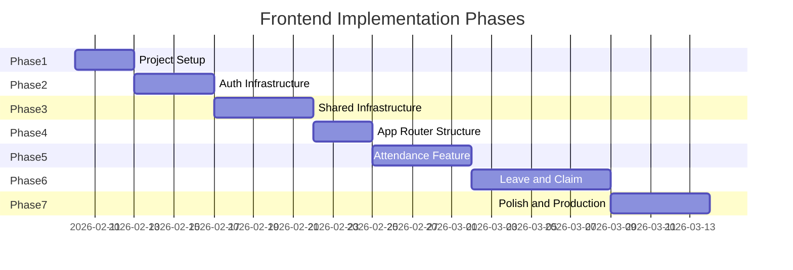

# Frontend Implementation Plan

This plan outlines the phased implementation of the BeLive FlowOffice frontend, a Next.js 16+ application integrating with Lark and Laravel. The project uses a flat structure with feature modules organized under `src/features/` and shared utilities under `src/shared/`, following Next.js best practices.

---

## Phase 1: Project Setup and Foundation

**Goal:** Establish a properly configured Next.js 16+ application with TypeScript, Tailwind CSS, and essential tooling.

**Status:** ✅ Completed

### 1.1 Initialize Next.js Application

- Created Next.js app using `create-next-app` with TypeScript, Tailwind CSS, ESLint, and the App Router enabled
- Selected `src/` directory option for cleaner separation
- Configured development server on port 3000

### 1.2 Configure TypeScript Strictly

- Enabled strict mode in `tsconfig.json`
- Configured path aliases for clean imports:
  - `@/*` pointing to `./src/*`
  - `@/features/*` pointing to `./src/features/*`
  - `@/shared/*` pointing to `./src/shared/*`
  - `@/components/*` pointing to `./src/components/*`

### 1.3 Establish Directory Structure

Created the project folder structure:

```
Belive-FO-Client/
├── src/
│   ├── app/                    # Next.js App Router
│   │   ├── (public)/          # Public routes
│   │   │   ├── layout.tsx
│   │   │   └── login/         # Login page
│   │   │       ├── page.tsx
│   │   │       └── _components/
│   │   │           ├── AuthLogin.tsx
│   │   │           ├── SocialButtons.tsx
│   │   │           ├── LeftSidebar.tsx
│   │   │           └── LarkSuiteButton.tsx
│   │   ├── layout.tsx          # Root layout
│   │   ├── page.tsx
│   │   └── globals.css
│   ├── components/            # Shared UI components
│   │   ├── shared/           # App-specific components
│   │   │   └── FullLogo.tsx
│   │   └── ui/               # shadcn/ui components
│   │       ├── button.tsx
│   │       ├── input.tsx
│   │       ├── label.tsx
│   │       └── checkbox.tsx
│   ├── features/             # Feature modules
│   │   ├── attendance/       # Attendance management (planned)
│   │   │   └── index.ts
│   │   ├── leave/            # Leave requests (planned)
│   │   │   └── index.ts
│   │   ├── claims/           # Expense claims (planned)
│   │   │   └── index.ts
│   │   └── lark-sdk/         # Lark integration (planned)
│   │       └── index.ts
│   ├── shared/               # Shared utilities
│   │   ├── hooks/            # Custom React hooks
│   │   │   ├── useAuth.ts
│   │   │   ├── useHydration.ts
│   │   │   ├── usePermissions.ts
│   │   │   └── index.ts
│   │   ├── lib/              # Utility functions
│   │   │   ├── api-client/   # API clients
│   │   │   │   ├── axios.ts
│   │   │   │   ├── laravel-client.ts
│   │   │   │   ├── response-handler.ts
│   │   │   │   ├── constants.ts
│   │   │   │   └── index.ts
│   │   │   ├── validation/   # Zod schemas
│   │   │   │   ├── common.schemas.ts
│   │   │   │   ├── validators.ts
│   │   │   │   └── index.ts
│   │   │   ├── event-bus.ts  # Event bus (placeholder)
│   │   │   ├── permissions.ts
│   │   │   ├── rbac.ts
│   │   │   └── transform.ts
│   │   ├── stores/           # Zustand stores
│   │   │   ├── auth-store.ts
│   │   │   └── ui-store.ts
│   │   ├── types/            # TypeScript types
│   │   │   ├── api.types.ts
│   │   │   ├── permissions.ts
│   │   │   ├── roles.ts
│   │   │   └── index.ts
│   │   └── index.ts          # Public API exports
│   └── lib/                  # Core utilities
│       └── utils.ts         # shadcn/ui utilities
├── public/                   # Static assets
│   └── images/              # Images (logos, backgrounds, icons)
├── docs/                     # Documentation
├── package.json
├── tsconfig.json
├── next.config.ts
└── turbo.json                # Turborepo config (for build caching)
```

### 1.4 Configure ESLint

- Set up ESLint configuration following Next.js recommendations
- Configured import sorting rules for consistency

### 1.5 Install Core Dependencies

**Root dependencies:**
- **State Management:** TanStack Query, Zustand
- **Forms:** react-hook-form, @hookform/resolvers, Zod
- **UI:** shadcn/ui (initialized), lucide-react
- **HTTP Client:** Axios
- **Build Tools:** Turborepo (for build caching)

### 1.6 Set Up Environment Variables

- Created `.env` with:
  - `NEXT_PUBLIC_SUPABASE_URL`
  - `NEXT_PUBLIC_SUPABASE_ANON_KEY`
  - `NEXT_SUPABASE_SECRET`
  - `NEXT_SUPABASE_JWT_SECRET`
  - `NEXT_PUBLIC_LARAVEL_API_URL`
  - `BFF_INTERNAL_SECRET`
  - `NEXT_PUBLIC_LARK_APP_ID`
  - `NEXT_PUBLIC_LARK_REDIRECT_URI`

**Success Criteria:**

- ✅ Next.js app runs with `pnpm dev` without errors
- ✅ TypeScript compiles with no errors in strict mode
- ✅ Path aliases work correctly (`@/shared/`, `@/features/`, `@/components/`)
- ✅ shadcn/ui components render properly
- ✅ Login page with Lark OAuth button implemented

---

## Phase 2: Authentication Infrastructure

**Goal:** Implement Lark OAuth flow; token in httpOnly cookie, user in store for UI.

**Status:** 🟡 Partially Completed (Login page UI done, OAuth callback pending)

### 2.1 Create Lark SDK TypeScript Declarations

- Create `src/features/lark-sdk/index.ts` with TypeScript interfaces for `window.tt` global object
- Include types for `getLocation`, `chooseImage`, `getWifiStatus`
- Create a wrapper module with availability checks
- Export from `src/features/lark-sdk/index.ts` for use in other features

### 2.2 Implement Auth Store (Zustand)

- ✅ Created `src/shared/stores/auth-store.ts`
- ✅ Store `apiToken`, `supabaseToken`, and `user` object
- ✅ Use `persist` middleware with `partialize` to persist user (and authMethod) only; no token in store
- ✅ Implement `setTokens`, `logout`, and `isAuthenticated` methods
- ✅ Export from `src/shared/index.ts` for use in app and other features

### 2.3 Build Lark OAuth Flow

- Create `src/lib/auth/lark-auth.ts` with `loginWithLark(code)` function (planned)
- Send code to Next.js `/api/auth/lark/callback`; Next.js calls Laravel, sets httpOnly cookie, returns user
- Use auth store from `@/shared` to store user for UI

### 2.4 Create Auth Callback Page

- Implement `src/app/auth/callback/page.tsx` as a Client Component (planned)
- Extract `code` from URL search params
- Call `loginWithLark` (hits Next.js); store user via auth store; redirect to dashboard

### 2.5 Implement Next.js Middleware for Route Protection

- Create `src/middleware.ts` at app root (planned)
- Check for httpOnly auth cookie (e.g. `belive_auth_token`) presence
- Redirect unauthenticated users to `/login`
- Configure matcher to exclude public routes (`/login`, `/auth/*`, `/_next/*`)

### 2.6 Handle Hydration Safety for Auth State

- ✅ Created `useHydration` hook in `src/shared/hooks/useHydration.ts`
- ✅ Export from `src/shared/index.ts`
- Wrap auth-dependent components with hydration guards (planned)
- Use skeleton loaders during hydration to prevent mismatches

### 2.7 Login Page Implementation

- ✅ Created `src/app/(public)/login/page.tsx` with side-layout design
- ✅ Implemented `SocialButtons` component with Lark OAuth button (uses Lark.png icon)
- ✅ Implemented `AuthLogin` component with username/password form
- ✅ Implemented `LeftSidebar` component with auth background image
- ✅ Implemented `FullLogo` component with FlowOffice branding and Lark icon

**Success Criteria:**

- ✅ Login page UI implemented with Lark OAuth button
- ✅ Auth store created and configured
- ✅ Hydration hook implemented
- ⏳ Lark OAuth redirect callback (planned)
- ⏳ Tokens stored and persisted across page refreshes (planned)
- ⏳ Protected routes redirect to login when unauthenticated (planned)
- ⏳ No hydration mismatch errors in console (planned)

---

## Phase 3: Shared Infrastructure

**Goal:** Build the shared infrastructure that all feature modules depend on.

**Status:** 🟡 Partially Completed

### 3.1 Set Up Shared Module

- ✅ Created `src/shared/` directory structure
- ✅ Created `src/shared/index.ts` to export public API
- ✅ Dependencies installed: Zustand, @supabase/supabase-js, @tanstack/react-query, Axios

### 3.2 Create Event Bus for Module Communication

- ✅ Created `src/shared/lib/event-bus.ts` (currently a placeholder)
- ⏳ Implement typed event subscriptions with `on(event, callback)`
- ⏳ Implement event emission with `emit(event, payload)`
- ⏳ Return unsubscribe functions for cleanup
- ✅ Export from `src/shared/index.ts`

### 3.3 Build Laravel API Client

- ✅ Created `src/shared/lib/api-client/` directory
- ⏳ Create `src/shared/lib/transform.ts` with `keysToCamel` and `keysToSnake` functions (planned)
  - Recursive object key transformation for nested objects and arrays
  - Preserve FormData and special types (Date, File, etc.)
  - Handle edge cases (null, undefined, primitives)
- ✅ Axios instance points to same-origin (Next.js)
  - `laravelApi`: Base URL `''`; auth routes `/api/auth/*`, proxied API `/api/proxy/*`
  - `withCredentials: true` so httpOnly auth cookie is sent
  - No CSRF or client-side Bearer; Next.js Route Handlers add Bearer from cookie
- ✅ Request/response: camelCase ↔ snake_case transform only
- ✅ `laravel-client.ts`: `loginWithEmail`, `loginWithLark`, `getCurrentUser`, `logoutUser` call Next.js routes
- ✅ Export from `src/shared/lib/api-client/index.ts`

**Architecture Notes:**
- All API from browser goes to Next.js; Next.js proxies to Laravel with `LARAVEL_API_URL` and Bearer from httpOnly cookie
- Automatic transformations for camelCase/snake_case; no CSRF for API
- All API calls go through React Query hooks for caching and state management (see Phase 3.4)

### 3.4 Configure TanStack Query

- ✅ Created `src/components/providers/query-provider.tsx` with QueryClient configuration
- ✅ Configured QueryClient with sensible defaults:
  - `staleTime`: 60 seconds (1 minute) - data considered fresh
  - `gcTime`: 10 minutes - garbage collection time for unused queries
  - `refetchOnWindowFocus`: false - don't refetch on tab focus
  - `refetchOnReconnect`: true - refetch when network reconnects
  - `refetchOnMount`: true - refetch if data is stale on mount
- ✅ Implemented smart retry logic:
  - Queries: No retry on 401 (unauthorized) or 4xx errors
  - Queries: Retry up to 2 times for 5xx server errors and network errors
  - Mutations: No retry on 401 or any 4xx errors
  - Mutations: Retry once for 5xx server errors and network errors
  - Exponential backoff: `Math.min(1000 * 2 ** attemptIndex, 30000)`
- ✅ Added React Query DevTools in development mode
  - Position: bottom-right
  - Initial state: closed
  - Provides visibility into query cache, mutations, and network requests
- ✅ Integrated in `src/app/layout.tsx` via `QueryProvider` component
- ✅ Added development logging for query and mutation tracking
  - Logs query/mutation lifecycle events (added, updated, removed, error)
  - Periodic cache state logging every 10 seconds
  - Exposes `queryClient` to `window.__REACT_QUERY_CLIENT__` for debugging

**Architecture Notes:**
- QueryClient uses singleton pattern with `useState` to ensure one instance per component tree
- All API calls should use React Query hooks (`useQuery`, `useMutation`) instead of calling API functions directly
- Global error handling can be added via `queryCache` and `mutationCache` subscribers if needed
- The configuration balances freshness with performance - adjust `staleTime` per feature as needed

### 3.5 Create Supabase Client Factory

- ✅ Created `src/shared/lib/supabase/client.ts` with `getSupabaseClient()` function
- ✅ Initialize client with Supabase JWT from auth store
- ✅ Set `persistSession: false` (Laravel manages auth)
- ⏳ Reset client when user logs out (subscribe to auth store changes)
- ✅ Export from `src/shared/index.ts`

### 3.6 Build Realtime Subscription Hook

- ⏳ Create `src/shared/hooks/useSupabaseRealtime.ts` (planned)
- ⏳ Accept table, event type, optional filter, and callback
- ⏳ Handle channel subscription and cleanup in useEffect
- ⏳ Integrate with TanStack Query for cache updates
- ⏳ Export from `src/shared/index.ts`

### 3.7 Create Supabase Storage Helpers

- ⏳ Implement `src/shared/lib/supabase/storage.ts` with upload/download/delete functions (planned)
- ⏳ Support signed URL generation for secure access
- ⏳ Handle error cases gracefully
- ⏳ Export from `src/shared/index.ts`

### 3.8 Set Up UI Store for Global Preferences

- ✅ Created `src/shared/stores/ui-store.ts`
- ✅ Manage sidebar state, theme, and language
- ✅ Use `persist` middleware with hydration guards
- ✅ Export from `src/shared/index.ts`

### 3.9 Build Shared UI Components

- ✅ Added essential shadcn/ui components to `src/components/ui/` (Button, Input, Label, Checkbox)
- ⏳ Create app shell layout components (AppShell, Navigation, Sidebar) in `src/shared/components/layout/` (planned)
- ⏳ Implement ErrorBoundary component for graceful error handling (planned)

**Success Criteria:**

- ✅ API client successfully calls Laravel endpoints
- ✅ UI store persists preferences without hydration errors
- ✅ Supabase client factory created
- ⏳ Event bus correctly publishes and subscribes to events (placeholder exists)
- ✅ TanStack Query caches and refetches data correctly (configured)
- ⏳ Supabase Realtime subscriptions receive updates (planned)

---

## React Query & Axios Setup Architecture

This section documents the established patterns for API communication and state management using TanStack React Query v5 and Axios.

### Architecture Overview

The project uses a layered architecture for API communication:

1. **Axios Instances** - Configured HTTP clients with interceptors
2. **API Functions** - Pure functions that call endpoints and validate responses
3. **React Query Hooks** - Hooks that wrap API functions with caching and state management
4. **Components** - Use hooks, never call API functions directly

### 1. Axios Instances

Axios is configured for **same-origin calls to Next.js**, which then proxies to Laravel:

- **`laravelApi`**: For all browser → Next.js calls:
  - Auth routes: `/api/auth/login`, `/api/auth/me`, `/api/auth/lark/callback`, `/api/auth/logout`
  - Proxied API routes: `/api/proxy/...`
  - Base URL: `''` (same-origin)
  - Automatic camelCase ↔ snake_case transformation
  - `withCredentials: true` so browser cookies (including auth/cache cookies) are sent to Next.js

- **`laravelRootApi`**:
  - Currently an alias of `laravelApi`
  - Kept for compatibility; no direct browser → Laravel calls

Laravel CSRF handling is done **inside Next.js Route Handlers**, not in the browser:

- Login/logout handlers call Laravel with:
  - `Cookie` header built from browser cookies (Laravel session + `XSRF-TOKEN`)
  - `X-XSRF-TOKEN` header derived from the `XSRF-TOKEN` cookie
  - Optional `Authorization: Bearer <token>` from the httpOnly Bearer cookie
- Other API handlers (`/api/proxy/...`, `/api/auth/me`) forward:
  - `Cookie` header for Laravel’s session
  - Optional `Authorization: Bearer <token>` for `auth:sanctum` APIs

### 2. Transform Utilities

Located in `src/shared/lib/transform.ts`:
- `keysToCamel(obj)`: Recursively converts snake_case keys to camelCase
- `keysToSnake(obj)`: Recursively converts camelCase keys to snake_case
- Handles nested objects, arrays, and preserves special types (FormData, Date, etc.)

### 3. API Layer Pattern

Each feature module follows this structure:

```
src/features/<feature>/
  ├── api/              # API functions (pure functions, no hooks)
  │   └── <feature>.ts  # getUsers, createUser, etc.
  ├── hooks/            # React Query hooks
  │   └── use<Feature>.ts
  ├── types/            # TypeScript types and Zod schemas
  │   └── index.ts
  ├── constants.ts      # Query keys and configuration
  └── index.ts          # Public API exports
```

**API Functions:**
- Pure functions that return promises
- Use `laravelApi` or `laravelRootApi` for HTTP calls
- Validate inputs with Zod schemas
- Validate outputs with Zod schemas
- Throw errors for invalid responses

**Example:**
```typescript
export async function getUsers(): Promise<User[]> {
  const { data: response } = await laravelApi.get('/users')
  return UsersListSchema.parse(response.data)
}
```

### 4. Query Keys Pattern

Centralized query keys with proper TypeScript typing:

```typescript
export const AUTH_QUERY_KEYS = {
  ME: ['auth', 'me'] as const,
  USERS: ['users'] as const,
  USER: (uuid: string) => ['user', uuid] as const,
} as const
```

**Best Practices:**
- Use arrays for query keys (not strings)
- Use `as const` for type safety
- Include parameters in keys for parameterized queries
- Keep keys flat and predictable for easy invalidation

### 5. Query Options Pattern

Use `queryOptions` factory for reusable query configurations:

```typescript
export const authQueryOptions = queryOptions({
  queryKey: AUTH_QUERY_KEYS.ME,
  queryFn: getMe,
  staleTime: AUTH_CONFIG.STALE_TIME,
  retry: AUTH_CONFIG.RETRY,
})
```

**Benefits:**
- Reusable across components
- Type-safe with TypeScript inference
- Can be used with `useQuery` or `queryClient.fetchQuery`

### 6. Hook Pattern

**Query Hooks:**
```typescript
export function useAuth() {
  return useQuery(authQueryOptions)
}
```

**Mutation Hooks:**
```typescript
export function useLogin() {
  const queryClient = useQueryClient()
  
  return useMutation({
    mutationFn: login,
    onSuccess: (user) => {
      // Update cache
      queryClient.setQueryData(AUTH_QUERY_KEYS.ME, user)
      // Invalidate related queries
      queryClient.invalidateQueries({ queryKey: AUTH_QUERY_KEYS.USERS })
    },
  })
}
```

### 7. Cache Management

**After Mutations:**
- Use `setQueryData` for instant UI updates (optimistic updates)
- Use `invalidateQueries` to refetch related data
- Use `refetchQueries` for append-only data (like activity logs)

**Query Invalidation:**
```typescript
// Invalidate all user-related queries
queryClient.invalidateQueries({ queryKey: ['users'], exact: false })

// Invalidate specific query
queryClient.invalidateQueries({ queryKey: AUTH_QUERY_KEYS.ME })
```

### 8. Environment Variables

**Current Setup:**
- `LARAVEL_API_URL`: Server-only; used by Next.js Route Handlers (auth and proxy) to call Laravel. Never exposed to the browser.
- `AUTH_COOKIE_NAME`: Optional; name of the httpOnly cookie holding the Bearer token (default `belive_auth_token`).
- Browser never calls Laravel directly; all API goes through Next.js (`/api/auth/*`, `/api/proxy/*`) with credentials so the httpOnly cookie is sent.

### 9. Common Patterns

**Query with Parameters:**
```typescript
export function usersQueryOptions(params?: GetUsersParams) {
  return queryOptions({
    queryKey: [...AUTH_QUERY_KEYS.USERS, params],
    queryFn: () => getUsers(params),
    enabled: params !== undefined,
    staleTime: USER_QUERY_CONFIG.STALE_TIME,
  })
}
```

**Mutation with Cache Updates:**
```typescript
export function useUpdateUser() {
  const queryClient = useQueryClient()
  
  return useMutation({
    mutationFn: updateUser,
    onSuccess: (updatedUser) => {
      // Update specific cache entry
      queryClient.setQueryData(AUTH_QUERY_KEYS.USER(updatedUser.uuid), updatedUser)
      // Invalidate related queries
      queryClient.invalidateQueries({ queryKey: ['users'], exact: false })
    },
  })
}
```

### 10. Important Rules

1. **Always use React Query hooks** - Never call API functions directly in components
2. **Use stable query keys** - Avoid object references in keys (use primitives or stringify)
3. **Handle cache invalidation** - Update or invalidate related queries after mutations
4. **Use `placeholderData: keepPreviousData`** - For lists to prevent flickering during refetches
5. **Prefer `refetchQueries` over `invalidateQueries`** - For append-only data (like activity logs)

### Reference

For complete setup details, see the **React Query & Axios Setup Guide** provided in the project documentation.

---

## Phase 4: App Router Structure and Layouts

**Goal:** Set up the Next.js App Router with proper layouts following best practices.

**Status:** 🟡 Partially Completed

### 4.1 Create Root Layout

- ✅ Implemented `src/app/layout.tsx` with HTML structure
- ✅ Wrapped children with `QueryProvider` from `@/components/providers/query-provider`
  - Provides React Query context to entire app
  - Includes React Query DevTools in development
- ⏳ Include Lark JS SDK script in head (planned)
- ✅ Set up font loading with `next/font` (Geist fonts)
- ✅ Configure metadata for SEO

### 4.2 Create Route Groups

- ✅ Set up `(public)` route group in `src/app/(public)/` for login and public pages
- ✅ Created `src/app/(public)/layout.tsx` with minimal layout
- ⏳ Set up `(authenticated)` route group in `src/app/(authenticated)/` for protected pages (planned)
- ⏳ Each group gets its own layout for different UI shells (planned)

### 4.3 Implement Authenticated Layout

- ⏳ Create `src/app/(authenticated)/layout.tsx` (planned)
- ⏳ Import and use AppShell, Navigation, and Sidebar components from `@/shared` (planned)
- ⏳ Initialize global Supabase Realtime listeners here (planned)
- ⏳ Handle auth checking and redirects using auth store from `@/shared` (planned)

### 4.4 Create Loading and Error States

- ⏳ Add `loading.tsx` files for route-level loading UI (planned)
- ⏳ Add `error.tsx` files for route-level error boundaries (planned)
- ⏳ Create `not-found.tsx` for 404 handling (planned)
- ⏳ Use React Suspense boundaries where appropriate (planned)

### 4.5 Configure Server Components vs Client Components

- ✅ Default to Server Components for pages
- ✅ Mark interactive components with `'use client'` directive (SocialButtons, AuthLogin, etc.)
- ✅ Import feature components from `@/features/*` and shared from `@/shared/*`
- ⏳ Identify data fetching patterns (server vs client) (planned)
- ⏳ Plan component composition to minimize client bundle (planned)

**Success Criteria:**

- ✅ Route groups correctly apply different layouts (public group done)
- ✅ Server and Client Components work together without issues
- ⏳ Loading states appear during navigation (planned)
- ⏳ Error boundaries catch and display errors gracefully (planned)

---

## Phase 5: Attendance Feature (First Feature Module)

**Goal:** Build the first complete feature module as a vertical slice.

**Status:** ⏳ Planned

### 5.1 Create Feature Structure

- ✅ Created `src/features/attendance/` directory
- ✅ Created `src/features/attendance/index.ts` (placeholder)
- ⏳ Add dependency on `@/shared` for API client and hooks
- ⏳ Add dependency on `@/features/lark-sdk` for GPS functionality
- ⏳ Set up TypeScript configuration (uses root config)

Create `src/features/attendance/` with:

- `api/` - Feature API layer (attendance-api.ts)
- `components/` - Feature UI components
- `hooks/` - Business logic hooks
- `types/` - TypeScript definitions
- `events/` - Event definitions for module communication
- `index.ts` - Public API exports

### 5.2 Define Feature Types

- ⏳ Create attendance types in `src/features/attendance/types/index.ts` (Attendance, ClockInData, AttendanceStats)
- ⏳ Define event payload types (AttendanceClockedInPayload)
- ⏳ Export only public types from `src/features/attendance/index.ts`

### 5.3 Implement Feature API Layer

- ⏳ Create `src/features/attendance/api/attendance.ts` with API functions (planned)
  - Use `laravelApi` from `@/shared/lib/api-client` for versioned endpoints
  - Validate responses with Zod schemas
  - Throw errors for invalid responses

**Example implementation:**

```typescript
// src/features/attendance/api/attendance.ts
import { laravelApi } from '@/shared/lib/api-client'
import { AttendanceSchema, ClockInInputSchema, AttendanceListSchema } from '../types'

export async function clockIn(data: ClockInInput): Promise<Attendance> {
  ClockInInputSchema.parse(data) // Validate input
  const { data: response } = await laravelApi.post('/attendance/clock-in', data)
  const result = AttendanceSchema.safeParse(response.data)
  if (!result.success) {
    throw new Error(`Invalid response: ${result.error.message}`)
  }
  return result.data
}

export async function clockOut(): Promise<Attendance> {
  const { data: response } = await laravelApi.post('/attendance/clock-out')
  return AttendanceSchema.parse(response.data)
}

export async function getAttendanceList(params?: GetAttendanceListParams): Promise<AttendanceList> {
  const { data: response } = await laravelApi.get('/attendance', { params })
  return AttendanceListSchema.parse(response.data)
}

export async function getAttendanceStats(): Promise<AttendanceStats> {
  const { data: response } = await laravelApi.get('/attendance/stats')
  return AttendanceStatsSchema.parse(response.data)
}
```

- ⏳ Export API functions from `src/features/attendance/index.ts`

### 5.4 Build TanStack Query Hooks

- ⏳ Create `src/features/attendance/constants.ts` with query keys and config (planned)

**Example implementation:**

```typescript
// src/features/attendance/constants.ts
export const ATTENDANCE_QUERY_KEYS = {
  LIST: ['attendance', 'list'] as const,
  STATS: ['attendance', 'stats'] as const,
  RECORD: (id: string) => ['attendance', 'record', id] as const,
} as const

export const ATTENDANCE_CONFIG = {
  STALE_TIME: 60 * 1000, // 1 minute
  GC_TIME: 10 * 60 * 1000, // 10 minutes
} as const
```

- ⏳ Create `src/features/attendance/hooks/useAttendance.ts` with query hooks (planned)
  - Use `queryOptions` factory pattern for reusability
  - Implement cache invalidation on mutations
  - Add optimistic updates for better UX

**Example implementation:**

```typescript
// src/features/attendance/hooks/useAttendance.ts
import { useQuery, useMutation, useQueryClient, queryOptions } from '@tanstack/react-query'
import { clockIn, clockOut, getAttendanceList, getAttendanceStats } from '../api/attendance'
import { ATTENDANCE_QUERY_KEYS, ATTENDANCE_CONFIG } from '../constants'

// Query options factory
export const attendanceListOptions = (params?: GetAttendanceListParams) => queryOptions({
  queryKey: [...ATTENDANCE_QUERY_KEYS.LIST, params],
  queryFn: () => getAttendanceList(params),
  staleTime: ATTENDANCE_CONFIG.STALE_TIME,
  gcTime: ATTENDANCE_CONFIG.GC_TIME,
})

export const attendanceStatsOptions = queryOptions({
  queryKey: ATTENDANCE_QUERY_KEYS.STATS,
  queryFn: getAttendanceStats,
  staleTime: ATTENDANCE_CONFIG.STALE_TIME,
})

// Query hooks
export function useAttendanceList(params?: GetAttendanceListParams) {
  return useQuery(attendanceListOptions(params))
}

export function useAttendanceStats() {
  return useQuery(attendanceStatsOptions)
}

// Mutation hooks
export function useClockIn() {
  const queryClient = useQueryClient()
  
  return useMutation({
    mutationFn: clockIn,
    onSuccess: (newAttendance) => {
      // Invalidate and refetch related queries
      queryClient.invalidateQueries({ queryKey: ATTENDANCE_QUERY_KEYS.LIST })
      queryClient.invalidateQueries({ queryKey: ATTENDANCE_QUERY_KEYS.STATS })
      // Optionally update cache directly for instant UI update
      queryClient.setQueryData(ATTENDANCE_QUERY_KEYS.RECORD(newAttendance.id), newAttendance)
    },
  })
}

export function useClockOut() {
  const queryClient = useQueryClient()
  
  return useMutation({
    mutationFn: clockOut,
    onSuccess: () => {
      queryClient.invalidateQueries({ queryKey: ATTENDANCE_QUERY_KEYS.LIST })
      queryClient.invalidateQueries({ queryKey: ATTENDANCE_QUERY_KEYS.STATS })
    },
  })
}
```

- ⏳ Export all hooks from `src/features/attendance/index.ts`

### 5.5 Create Realtime Subscription Hook

- ⏳ Create `src/features/attendance/hooks/useAttendanceRealtime.ts`
- ⏳ Subscribe to attendance table changes using `useSupabaseRealtime` from `@/shared`
- ⏳ Filter by current user ID
- ⏳ Update TanStack Query cache on INSERT/UPDATE events
- ⏳ Export from `src/features/attendance/index.ts`

### 5.6 Build Feature Components

- ⏳ Create `src/features/attendance/components/ClockInButton.tsx` - Handles clock-in flow with GPS
- ⏳ Create `src/features/attendance/components/AttendanceList.tsx` - Displays attendance records
- ⏳ Create `src/features/attendance/components/AttendanceCard.tsx` - Individual record display (private, not exported)
- ⏳ Keep internal components private, export only public ones from `src/features/attendance/index.ts`

### 5.7 Create Attendance Page

- ⏳ Create `src/app/(authenticated)/attendance/page.tsx` - Main attendance page
- ⏳ Import components and hooks from `@/features/attendance`
- ⏳ Compose components from feature's public API
- ⏳ Keep page thin (routing and composition only)

### 5.8 Wire Up Event Publishing

- ⏳ Publish `CLOCKED_IN` event on successful clock-in using event bus from `@/shared`
- ⏳ Publish `CLOCKED_OUT` event on successful clock-out
- ⏳ Allow other features to react to attendance changes via event bus

**Success Criteria:**

- Clock-in with GPS works when running in Lark
- Realtime updates appear without page refresh
- Attendance list displays correctly
- Events are published and can be subscribed to

---

## Phase 6: Leave and Claim Features

**Goal:** Build remaining feature modules following the same pattern.

**Status:** ⏳ Planned

### 6.1 Leave Feature Structure

- ✅ Created `src/features/leave/` directory
- ✅ Created `src/features/leave/index.ts` (placeholder)
- ⏳ Add dependencies: `@/shared`
- ⏳ Set up TypeScript configuration (uses root config)

Create `src/features/leave/` following same structure:

- Types: Leave, LeaveRequest, LeaveBalance in `src/features/leave/types/`
- API: submitLeave, getLeaveList, getLeaveBalance in `src/features/leave/api/`
- Hooks: useSubmitLeave, useLeaveList, useLeaveBalance, useLeaveRealtime in `src/features/leave/hooks/`
- Components: LeaveRequestForm, LeaveList, LeaveBalanceWidget in `src/features/leave/components/`
- Export all public APIs from `src/features/leave/index.ts`
- Listeners: Subscribe to attendance events for eligibility updates using event bus from `@/shared`

### 6.2 Claim Feature Structure

- ✅ Created `src/features/claims/` directory
- ✅ Created `src/features/claims/index.ts` (placeholder)
- ⏳ Add dependencies: `@/shared`, `@/features/lark-sdk`
- ⏳ Set up TypeScript configuration (uses root config)

Create `src/features/claims/` following same structure:

- Types: Claim, ClaimReceipt in `src/features/claims/types/`
- API: submitClaim, getClaimsList, uploadReceipt in `src/features/claims/api/`
- Hooks: useSubmitClaim, useClaimsList, useUploadReceipt in `src/features/claims/hooks/`
- Components: ClaimForm, ClaimsList, ReceiptUploader in `src/features/claims/components/`
- Export all public APIs from `src/features/claims/index.ts`
- Integrate Lark SDK from `@/features/lark-sdk` for camera capture
- Use Supabase Storage helpers from `@/shared` for receipt uploads

### 6.3 Cross-Feature Communication

- Leave feature listens to attendance `CLOCKED_IN` events via event bus from `@/shared`
- Refresh leave eligibility when user clocks in
- Use event bus for communication, not direct feature imports
- Features remain independent and can be developed in separate branches

### 6.4 Create Feature Pages

- ⏳ Create `src/app/(authenticated)/leave/page.tsx`
- ⏳ Create `src/app/(authenticated)/claims/page.tsx`
- ⏳ Import components and hooks from `@/features/leave` and `@/features/claims`
- ⏳ Keep pages thin, compose from feature public APIs

**Success Criteria:**

- ⏳ Each feature is self-contained and independently testable (planned)
- ⏳ Cross-feature communication works via event bus (planned)
- ⏳ No direct imports between feature internals (features communicate via public APIs) (planned)
- ⏳ All pages render correctly (planned)

---

## Phase 7: Polish and Production Readiness

**Goal:** Prepare the application for production deployment.

### 7.1 Error Handling and Edge Cases

- Implement proper error boundaries at feature module level
- Handle Lark SDK unavailability (desktop browser fallback) in `@/features/lark-sdk`
- Handle offline scenarios gracefully
- ✅ Retry logic configured in QueryProvider (smart retry for 5xx errors, no retry for 4xx)
- ✅ Auth via Next.js Route Handlers; no CSRF (httpOnly cookie, proxy pattern)
- Verify comprehensive error handling across all API calls

### 7.2 Performance Optimization

- Implement code splitting per feature module using dynamic imports: `dynamic(() => import('@/features/attendance'))`
- Optimize images with `next/image`
- Configure caching headers for static assets in Next.js config
- Analyze bundle size and reduce where possible
- Leverage Turborepo caching for faster builds

### 7.3 Accessibility Audit

- Ensure all interactive elements are keyboard accessible
- Verify color contrast ratios
- Add proper ARIA labels where needed
- Test with screen readers

### 7.4 Testing Setup

- Configure Jest and React Testing Library at root level
- Write unit tests for critical hooks in each feature module
- Write integration tests for feature flows
- Test feature boundaries through import paths (features use `@/shared`, not direct imports between features)

### 7.5 Production Configuration

- Configure environment variables for production in `.env.production`
- Set up proper CSP headers in Next.js config
- Configure CORS handling for API calls
- Set up monitoring and error tracking (optional: Sentry)
- Configure Turborepo for production builds

### 7.6 Documentation

- Document feature module public APIs in each feature's README or index.ts
- Create developer setup guide
- Document environment variable requirements
- Document feature development workflow and feature branch strategy
- Add inline comments for complex logic

**Success Criteria:**

- Application runs without console errors
- Lighthouse score above 90 for Performance
- All critical paths have test coverage
- Documentation is complete and accurate

---

## Implementation Timeline



---

## Key Next.js Best Practices Applied

1. **App Router First** - Using the modern App Router with Server Components by default
2. **Thin Pages** - Pages are composition layers, logic lives in feature modules
3. **Server Components by Default** - Only marking interactive parts as Client Components
4. **Proper Loading/Error States** - Using file-based loading.tsx and error.tsx (planned)
5. **Middleware for Auth** - Centralized route protection at the edge (planned)
6. **Environment Variables** - Proper separation of public vs server-only variables
7. **TypeScript Strict Mode** - Catching errors at compile time
8. **Path Aliases** - Clean imports using Next.js pattern:
   - `@/*` → `./src/*`
   - `@/features/*` → `./src/features/*`
   - `@/shared/*` → `./src/shared/*`
   - `@/components/*` → `./src/components/*`
9. **Feature Module Structure** - Features organized under `src/features/` for independent development
10. **Shared Utilities** - Common code in `src/shared/` for reuse across features
11. **Standard Next.js Structure** - Following Next.js conventions with `src/app/`, `src/components/`, `src/lib/` directories

